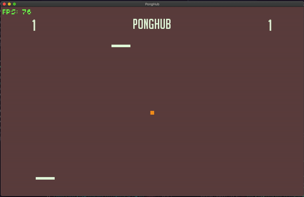
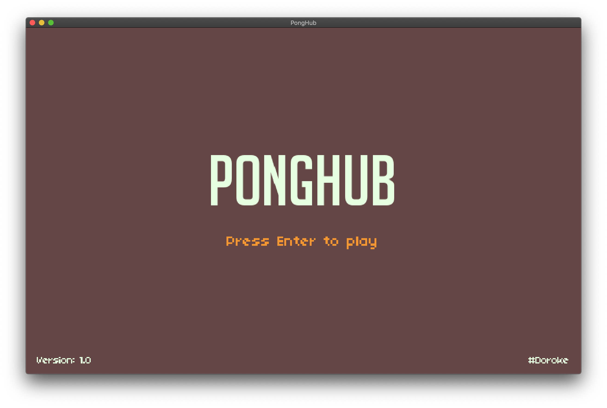
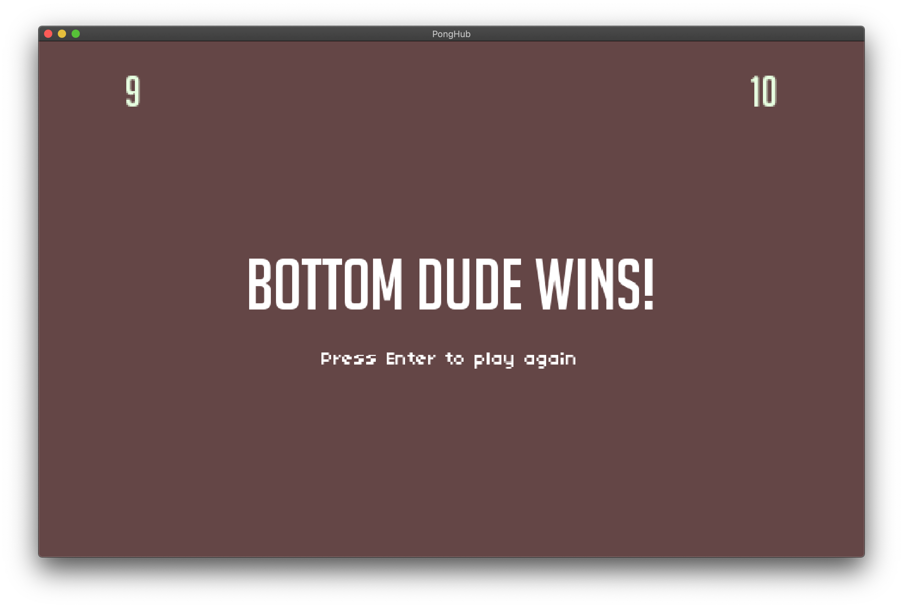

# [Ponghub](https://github.com/hoangdesu/Ponghub) [](https://github.com/facebook/react/blob/master/LICENSE)
###### *(an absolutely SFW game, suitable for your kids!)*

### Table of Contents
* [What?](#what)  
* [Download](#download) 
* [Installation](#installation) 
* [Controls](#controls)
* [Credits](#credits)
* [Connect](#connect)

<a name="what"></a>
# What?
This is my attempt of [CS50 Game Development's Pong tutorial](https://github.com/cs50/gd50/tree/master/pong). In my version, the game view is rotate to vertical. And don't even ask me about the title 👀



<a name="download"></a>
# Download
Download and extract the game to play:
* [Download for Windows 64-bits (v1.0)](https://github.com/hoangdesu/Ponghub/releases/download/v1.0/Ponghub-win64.zip)
* [Download for MacOS (v1.0)](https://github.com/hoangdesu/Ponghub/releases/download/v1.0/Ponghub.app.zip)
* [Download for web browser (v1.0)](https://github.com/hoangdesu/Ponghub/releases/download/v1.0/Web.game.zip) (need to run in a web server)

Check out the [Releases](https://github.com/hoangdesu/Ponghub/releases/tag/v1.0) page for the latest version.

<a name="controls"></a>
# Controls
The blinking player is the server.
##### Player 1 (top dude):
* Move: A, D
* Serve: S
##### Player 2 (bottom dude):
* Move: ⬅️ ➡️ (left/right arrow keys)
* Serve: ⬆️ (up arrow keys)

**ESC**: go back
**M**: mute sound

<a name="installation"></a>
## Installation
If you want to compile the game yourself, you'd need Lua and LÖVE2D framework.
If you are on a Mac, you can follow this instruction:
1. Install Lua:
```
brew install lua
```

2. Install LÖVE2D:
```
git clone https://github.com/love2d/love
```

3. Add love alias to your PATH:
```
alias love="/Applications/love.app/Contents/MacOS/love"
```

4. Clone the project:
```
git clone https://github.com/hoangdesu/Ponghub.git
```

5. Go to the project and run the game:
```
cd Ponghub/src
love .
```

<a name="screenshots"></a>
## Screenshots
<p align="center">Welcome screen</p>



<p align="center">Victory screen</p>



<a name="connect"></a>
## Connect with me
* My [Facebook](https://www.facebook.com/Hoangdayo/)
* My [Instagram](https://www.instagram.com/hoang.desu/)
* [Hit me up](tel:0913172602) for a coffee and talk just about everything!
* Shoot me an [email](mailto:hoangdesu@gmail.com) too


<a name="credits"></a>
## Credits
* [CS50's Pong github](https://github.com/cs50/gd50/tree/master/pong)
* BGM: Harvest Moon: A Wonderful Life - Breeze (my childhood)
* [love.js](https://github.com/Davidobot/love.js)


